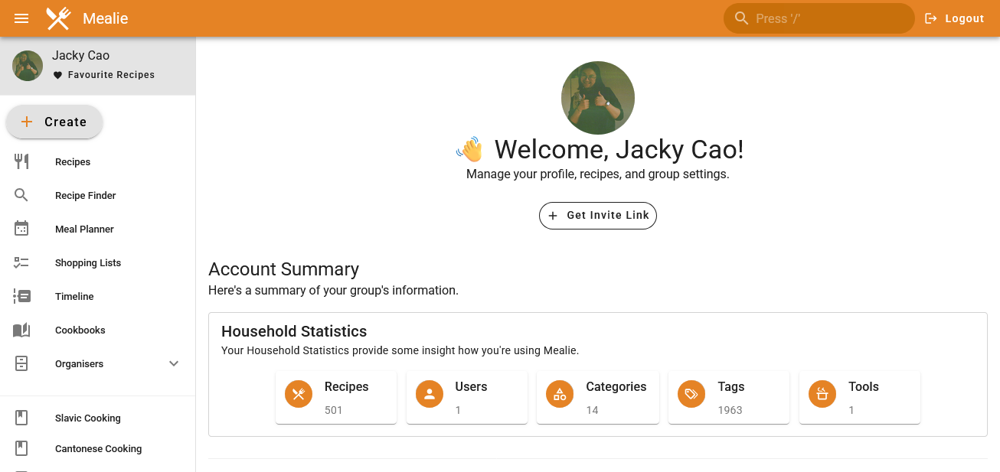

# Mealie

Mealie is my most used Home Lab service, I love cooking and being able to have my own recipe collection on hand is just great. I have previously tried to write down recipes in a journal, but if you want to collect a whole load of recipes and draw inspiration, writing all of them out is just not feasible. That is where Mealie comes in, I can (most of the time) copy in the URL of a recipe, have Mealie scrape it, format it, and then insert it into my recipe collection. Very handy stuff!

Plus, another advantage is its connection to artificial intelligence APIs, namely, OpenAI. It can use models to recognise the text from handwritten images, or to properly parse ingredients by their amount and type of ingredient. There are also some external tools which can connect to Mealie's API, such as creating recipes based off of Instagram posts[^1].

## References

[^1]: [https://github.com/JoTec2002/InstagramToMealie](https://github.com/JoTec2002/InstagramToMealie){:target="_blank"}