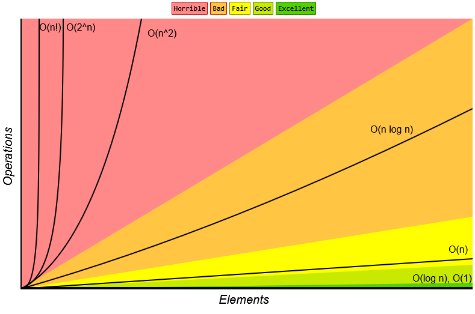

# Big-O Complexities

[O(N^2)](on2_complexity.md) is not the only type of time and space complexity, there are others[^1]. The figure shows some of the other types[^2], these are classed under the name of Big-O complexity, where the best performant time complexity is O(1), i.e., not depending on the input size and has a constant time complexity.

## References

[^1]: [https://www.freecodecamp.org/news/big-o-cheat-sheet-time-complexity-chart/](https://www.freecodecamp.org/news/bi1-o-cheat-sheet-time-complexity-chart/){:target="_blank"}
[^2]: [https://www.bigocheatsheet.com/](https://www.bigocheatsheet.com/){:target="_blank"}