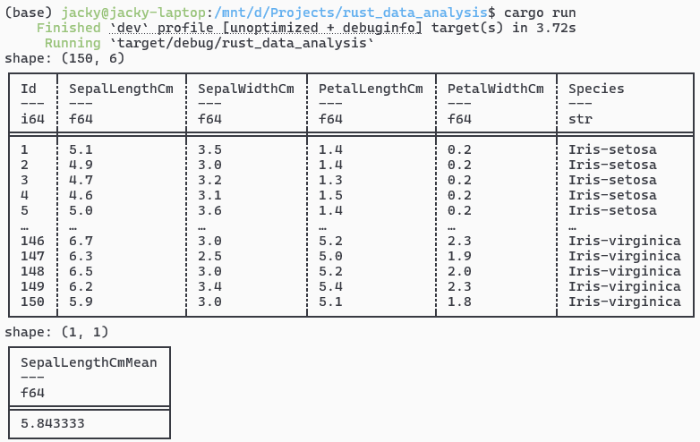

# Data analysis

## Using evcxr

To begin understanding Rust and data analysis, I will start with going over the Jupyter Notebooks found in [this](https://github.com/wiseaidev/rust-data-analysis/){:target="_blank"} repository. Writing and executing Rust code through Jupyter Notebooks is made possible due to [evcxr_jupyter](https://github.com/evcxr/evcxr/blob/main/evcxr_jupyter/README.md){:target="_blank"}, i.e., Jupyter Kernel for Rust.

I've taken the code from the linked repository and used it as the basis for my own local testing, my code can be found from [cao-jacky/rust_data_analysis](https://github.com/cao-jacky/rust_data_analysis){:target="_blank"}. Even with the first notebook, I see a lot of similar things as when I have used Polars, Pandas, Numpy, and matplotlib in Python. There are equivalents for Rust which seems like the transition would be quite straightforward.

I have tried to tabulate the equivalents below[^1].

| Python library | Rust equivalent | Example | Notes |
|---|---|---|---|
| [Polars](https://pola.rs/){:target="_blank"}/[Pandas](https://pandas.pydata.org/){:target="_blank"} | [Polars](https://docs.rs/polars/latest/polars/){:target="_blank"} | [data_analysis.ipynb](https://github.com/cao-jacky/rust_data_analysis/blob/main/notebooks/data_analysis.ipynb){:target="_blank"} | There does seem to be [pandrs](https://lib.rs/crates/pandrs){:target="_blank"}, a pandas-like DataFrame library for Rust, but I think I will settle with Polars for now. |
| [NumPy](https://numpy.org/){:target="_blank"} | [ndarray](https://docs.rs/ndarray/latest/ndarray/){:target="_blank"} | [ndarray.ipynb](https://github.com/cao-jacky/rust_data_analysis/blob/main/notebooks/ndarray.ipynb){:target="_blank"} | |

### Experiences

I have spent some amount of time exploring trying to deploy and use Rust with evcxr in a Jupyter notebook, and whilst there are equivalent libraries, there are caveats with running this setup and they are mainly related to the speed of execution (this is not an isolated problem that I am having[^2]).

I think the biggest bottleneck for me to use evcxr on a daily basis is the extremely long times needed to install evcxr dependencies through `:dep`, and the longer-than-Python times when executing cells. I am running this setup on a fairly powerful Windows machine using WSL2, which, arguably, maybe adding some overhead. But code should run fairly natively. Regardless of this, I have had a not entirely fast experience.

### evcxr dependencies

To be able to use additional libraries with evcxr, they have to be installed, makes sense. For example, if we want to use array structures from `ndarray`, then one of the first cells that need to be executed is:

```rust
:dep ndarray = {version = "0.15.6"}
```

One would expect, coming from `python-pip`, that it would be a quick ordeal. However, I have found that execution takes a significantly long time. I have tabulated the times, and overall, it takes around ~10.13 minutes before the depedencies are compiled. 

| Dependency | Installation time |
|---|---|
| `ndarray=0.15.6`| 6379 ms, or 6.34 s |
| `blas-src=0.9` | 299281 ms, or ~4.99 mins |
| `ndarray-linalg=0.16.0` | 293794 ms, or ~4.90 mins |
| `ndarray-rand=0.14.0` | 14748 ms, or 14.75 s |

Apparently, `:dep` roughly functions with evcxr by: creating a temporary Cargo crate, running dependency resolution, and compiling everything from scratch. The compilation appears to take place every time the kernel is restarted, i.e., the session is considered as an entirely fresh project. I am wondering if there is a way to force usage of the Cargo cache.  

## Using standard Rust and Cargo

After trying to use Rust in a similar manner as Python, i.e., through a Juypter notebook, I wanted to see if the experience would be better (i.e., not as slow) if I used Rust normally and compiled the code manually using Cargo. So, I followed the [Polars getting started guide for Rust](https://docs.pola.rs/user-guide/getting-started/){:target="_blank"}.

I created a basic file, `main.rs`, which would read the iris data from the previous evcxr testing, print the dataframe, and then calculate the mean of one of the columns.

```rust
use polars::prelude::*;
use std::error::Error;

fn main() -> Result<(), Box<dyn Error>> {
    let df_csv = CsvReadOptions::default()
        .with_has_header(true)
        .with_parse_options(CsvParseOptions::default().with_try_parse_dates(true))
        .try_into_reader_with_file_path(Some("data/Iris.csv".into()))?
        .finish()?;
    println!("{df_csv}");

    let result = df_csv
        .clone()
        .lazy()
        .select([
            col("SepalLengthCm").mean().alias("SepalLengthCmMean"),
        ])
        .collect()?;
    println!("{result}");
    Ok(())
}
```

I had some issues, mainly with trying to get the code to compile and then run. Using the latest Polars release (`v0.52.0`) led to some errors, so, I chose to use an older release (`v0.42.0`) instead. This is specified in my `Cargo.toml` file.

```toml
[package]
name = "rust_data_analysis"
version = "0.1.0"
edition = "2024"

[dependencies]
polars = { version = "0.42.0", features = ["lazy", "csv"]}
```

Running `cargo build` and then `cargo run` (without the `--release` flag), I get the following output, i.e., it works! Albeit, the code still takes several seconds to compile and then run. 



## Footnotes and references

[^1]: I find it quirky that executing Rust through evcxr in Jupyter still requires `.ipynb` notebooks. It makes sense, but still funny.
[^2]: [https://github.com/evcxr/evcxr/issues/52](https://github.com/evcxr/evcxr/issues/52){:target="_blank"}