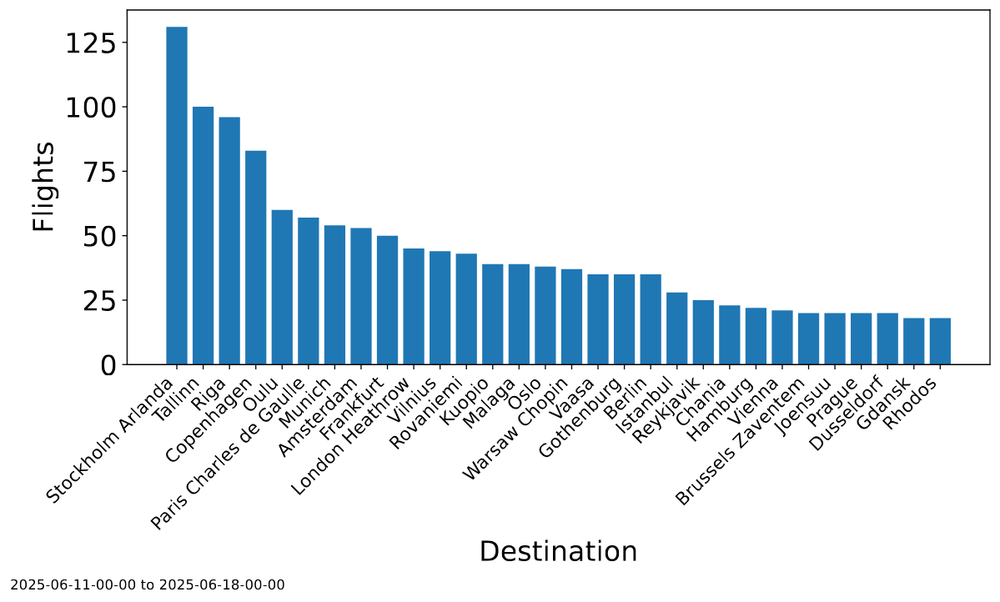
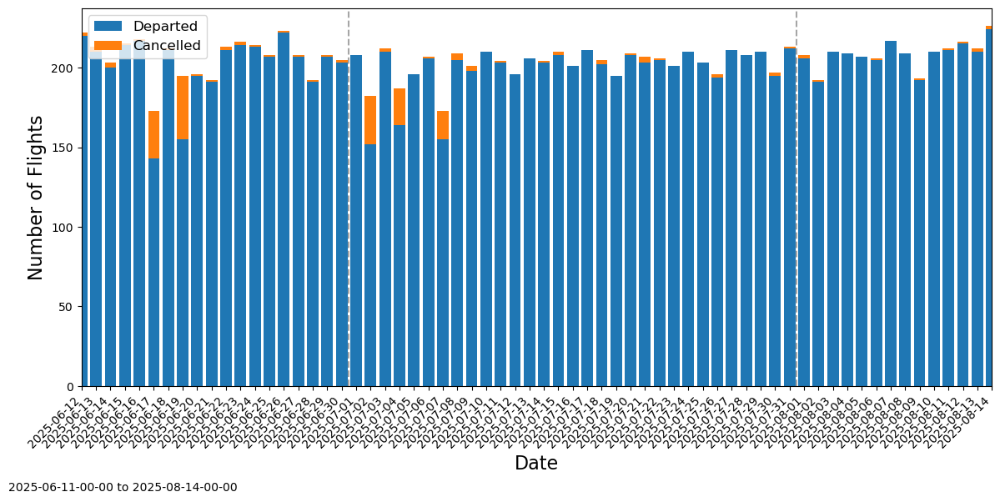

# Flights Analysis

## Project summary

As part of my work in the Business Finland Untangling People Flow project, I analysed flight data for Helsinki-Vantaa Airport. The goal was to be able to correlate between flights and the movement of passengers in the departure hall of the airport, and answer questions such as:

1. What destinations have the most flights to them?
2. Are there more flights to European (Schengen) countries, or to outside the Schengen area?
3. Which airline has the most flights in a week?
4. Can we prepare the flight data, so we can estimate the number of people checking from the LiDAR data?

The flight data was provided by an open API[^1] from Finavia, the Finnish company responsible for managing and maintaining several of Finland's airports; and the analysis was performed on CSC[^2] scientific computing infrastructure.

!!! success "Skills developed"
    Python (Pandas, Polars), data cleaning, data manipulation

## Project development

### Data cleaning

To begin with, the data needed to be collected from the Finavia API. For the project, I was already collecting LiDAR object positional data from a different API and storing it into CSC's Allas object storage[^3]. I created a new data bucket to house the data, forked the Python script to pull and upload the data to the bucket, and set the script to run as a cron job at the top of every hour.

The collected raw data needed to be cleaned and combined. This is because the Finavia Flight API provides the current day's worth of flight data plus and minus a few hours before and after the current day: before, because some flights may still be in the air, and after, since passengers should arrive a few hours before their flight to check-in. Furthermore, the data provided from the API is updated regularly to reflect the status of the flights, i.e., gate updates, whether the flight has taken off, landed, cancelled, etc. So, the final cleaned flight data should be:

1. Filtered for the selected day.
2. Updated to the latest/last details for the flight.
3. Updated to have estimations of the check-in start and end times.
4. Have the flights and their airline names mapped to them.

To perform this pre-cleaning, I was originally using a set of Pandas methods to sequentially perform each necessary cleaning step. However, I ended up learning about Polars and its supposed ability to handle and process large amounts of data. So, I rewrote the pre-cleaning into one Polars LazyFrame.

??? example "precleaning.py"

    ```py linenums="1"
    # Apply all the pre-processing as one LazyFrame operation
    df = (
        pl.scan_parquet(self.paths)

        # Convert sdt (scheduled flight date-time) to datetime
        .with_columns(
            pl.col("sdt", "est_d", "pest_d", "act_d", "ablk_d")
                .str.to_datetime("%Y-%m-%dT%H:%M:%SZ")
                .dt.replace_time_zone("UTC")
                .dt.convert_time_zone("Europe/Helsinki"),
            pl.col("gate").cast(pl.String),
            pl.col("^route_.*$").cast(pl.Utf8)
        )

        # Filter by date range
        .filter(pl.col("sdt").is_between(start_date, end_date, closed="left"))
        # Filter by departing flights
        .filter(pl.col("flight_type") == "departure")
        # Filter to Helsinki-Vantaa Airport
        .filter(pl.col("h_apt") == "HEL")
            
        # Create cflights list
        .with_columns(
            pl.concat_list([pl.col(c) for c in cflight_cols])
            .list.drop_nulls()
            .alias("cflights")
        )
        # Drop cflight columns
        .drop(cflight_cols)
        # Drop duplicates
        .unique()
            
        # Extract IATA code
        .with_columns(
            pl.col("fltnr").str.extract(r'^([A-Z]+)', 1).alias('iata_code')
        )
        # Join with carriers
        .join(df_carriers, on="iata_code", how="left")
        # Map airline names
        .with_columns(
            pl.col("carrier").replace(airline_name_map).alias("airline")
        )
        # Group by and aggregate
        .group_by(group_cols)
        .agg([
            # Flatten and get unique sorted cflights
            pl.col("cflights").flatten().unique().sort().alias("cflights"),
            # Take first value for all other columns
            pl.all().exclude(group_cols + ["cflights"]).first()
        ])

        # Convert check-in desk numbers to integers
        .with_columns(
            pl.col("chkarea", "chkdsk_1", "chkdsk_2").fill_null("0").cast(pl.Int64)
        )

        # Obtain the range of check-in desks
        .with_columns(
            pl.when(pl.col("chkdsk_1") == pl.col("chkdsk_2"))
            .then(pl.concat_list("chkdsk_1"))
            .otherwise(pl.concat_list("chkdsk_1", "chkdsk_2"))
            .alias("check_in_desks")
        )

        # Expand the range
        .with_columns(
            pl.int_ranges(
                pl.col("chkdsk_1"),
                pl.col("chkdsk_2") + 1
            ).alias("all_check_in_desks")
        )

        # Count non-null values in non-identifying columns
        .with_columns(
            pl.sum_horizontal(pl.all().exclude(id_cols).is_not_null()).alias("_non_null_count")
        )

        # Sort so "fuller" rows come first
        .sort("_non_null_count", descending=True)

        # Drop duplicates
        .unique(subset=id_cols, keep="first")

        # Remove helper column
        .drop("_non_null_count")

        # Get check-in times
        .join(
            df_check_in.select(["airline", "check-in_start_time", "check-in_end_time"]),
            on="airline",
            how="left"
        )

        # Parse time strings to duration components
        .with_columns(
            pl.col("check-in_start_time").str.split(":").alias("_start_parts"),
            pl.col("check-in_end_time").str.split(":").alias("_end_parts")
        )

        # Calculate actual check-in times
        .with_columns(
            (pl.col("sdt") - pl.duration(
                hours=pl.col("_start_parts").list.get(0).cast(pl.Int64),
                minutes=pl.col("_start_parts").list.get(1).cast(pl.Int64)
            )).alias("check_in_opens"),
            (pl.col("sdt") - pl.duration(
                hours=pl.col("_end_parts").list.get(0).cast(pl.Int64),
                minutes=pl.col("_end_parts").list.get(1).cast(pl.Int64)
            )).alias("check_in_closes"),
        )

        .drop(["check-in_start_time", "check-in_end_time", "_start_parts", "_end_parts"])
            
        # Cast gate to string
        .with_columns(pl.col("gate").cast(pl.Utf8)) 
        
        # Sort by scheduled flight datetime
        .sort("sdt")

        .collect()
    )
    ```

This cleaned data was exported to a parquet format and uploaded to a separate data bucket in Allas, ready for analysis.

### Data analysis

I performed the main analysis through CSC's Mahti supercomputer. Why not Puhti? Simply, because there was always more work jobs scheduled for Puhti than Mahti.

To answer the proposed questions, the data was loaded as a dataframe, and then queried/analysed using typical statistical analysis, such as:

```py
destinations = df["route_n_1"].value_counts().reset_index()
```

or,

```py
# Filter cancelled flights
df_cancelled = df[df["prt"] == "Cancelled"].copy()

# Extract date without time
df_cancelled['date'] = df_cancelled['sdt'].dt.date

# Count cancelled flights per date
cancelled_counts = df_cancelled.groupby('date').size().reset_index(name='count')

# Convert dates to datetime for month calculation
cancelled_counts['date_dt'] = pd.to_datetime(cancelled_counts['date'])

# Calculate statistics
avg_cancelled = cancelled_counts['count'].mean()
median_cancelled = cancelled_counts['count'].median()
stddev_cancelled = cancelled_counts['count'].std()
```

and then, the data was plotted using Matplotlib to create graph-based visualisations:

<figure markdown="span">
  
  <figcaption>The 30 top flight destinations for the data from 2025-06-11 00:00 to 2025-06-18 00:00.</figcaption>
</figure>

<figure markdown="span">
  
  <figcaption>A visualisation of the cancelled flights compared to those which actually departed for the data from 2025-06-11 00:00 to 2025-06-14 00:00.</figcaption>
</figure>

From these analyses, it was interesting to see that Finnair is, obviously, the airline that has the most flights which leave from Helsinki-Vantaa Airport, and that the most popular destinations from Helsinki are the capitals of the countries which are closest to Finland (i.e., Sweden, Estonia, Latvia, Denmark). Perhaps these conclusions are obvious, but having them verified from statistics proves that they are true.

## References

[^1]: [https://apiportal.finavia.fi](https://apiportal.finavia.fi){:target="_blank"}
[^2]: [https://csc.fi/en/](https://csc.fi/en/){:target="_blank"}
[^3]: [https://docs.csc.fi/data/Allas/](https://docs.csc.fi/data/Allas/){:target="_blank"}