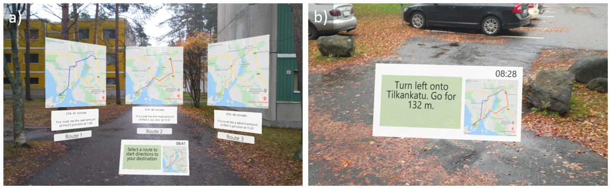
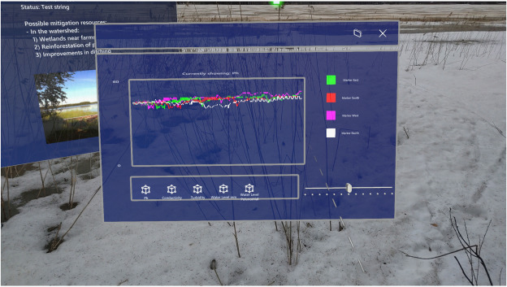

# HoloLens 2 Apps

## Project Summary

As an augmented reality researcher, I was able to test a variety of extended reality hardware and develop several interesting applications for them. Perhaps one of the most unique devices that I experimented with, was the Microsoft HoloLens 2. In my view, the key selling points were that the visualisations produced were of decent quality and there was the Mixed Reality Toolkit 2[^1], which supported the creation of HoloLens 2 applications.

I developed two systems/applications:

1. A system which allowed users to navigate through an environment based on air quality predictions rendered as holograms on a HoloLens 2[^2]. I created the HoloLens 2 application, a companion Android application, and server software to perform and return the machine learning results.

    

2. A prototype water quality visualisation application to allow scientists and decision makers to better understand the quality of water bodies in-situ[^3].

    

!!! success "Skills developed"
    C#, Unity, Android development, Kotlin, Java, Python

## Project Development

I gained a lot of hands-on experience with both C# and Unity, and the community resources (Mixed Reality Toolkit, Unity forums, etc.) were of tremendous help. It was interesting to develop extended reality applications in a game engine-based development environment, as opposed to developing for traditional smartphone applications. For example, with holograms, there were literal physical constraints of the environment impacting how users see and perceive them: if it was too bright, then holograms would typically not be viewable, or if the user moves too quickly, the holograms may sometimes become distorted. 

All-in-all, very interesting work!

## References

[^1]: [https://github.com/microsoft/MixedRealityToolkit-Unity](https://github.com/microsoft/MixedRealityToolkit-Unity){:target="_blank"}
[^2]: [https://ieeexplore.ieee.org/abstract/document/9685498/](https://ieeexplore.ieee.org/abstract/document/9685498/){:target="_blank"}
[^3]: [https://www.sciencedirect.com/science/article/pii/S1674237023001205](https://www.sciencedirect.com/science/article/pii/S1674237023001205){:target="_blank"}