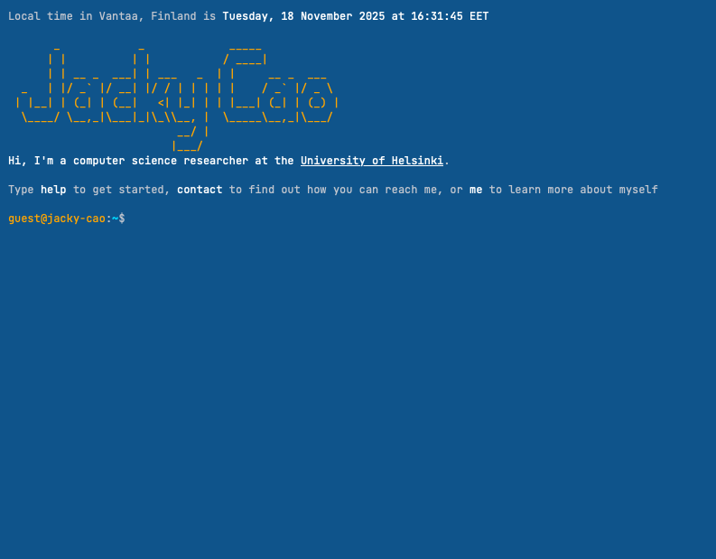

# Terminal Portfolio

## Project Summary
At the beginning of 2025, I was tinkering with my home lab and decided that I wanted a shorter domain to access my self-hosted services. At that time, I was primarily using `jackycao.co.uk`, so accessing my Vaultwaren instance would require a long-ish URL of `passwords.jackycao.co.uk`.

I had a look at 1.111B class `.xyz` domains, but decided to have a more personalised address that only my first name, Jacky. I read a reddit post[^1] and was inspired by `.sh`. It seemed like a good choice, i.e., short, `jacky.sh` was available, and since I am a computer scientist, having something related to shell from Unix/Linux was a fun idea.

With the domain and joke/idea in hand, I set about with trying to build a new portfolio that was based on a terminal command-line interface. It took a week or so to put it together, and I had it running as my main portfolio for several months before deciding to replace it with this current Zensical-based site.

I have since moved the terminal site to its own subdomain, and it can be accessed at [terminal.jacky.sh](https://terminal.jacky.sh){:target="_blank"}.

!!! success "Skills developed"
    JavaScript, CSS, web development

## Project Development
Since I wanted my website to function as an actual terminal then I had to find libraries or examples of such. Xterm.js[^2] was one possibility that I looked at but I decided against it since the terminal emulators created with it are supposed to be connected to a real Linux system. I did not want that. I just wanted a terminal-like experience where the logic and interaction was all self-contained in a user's web browser.

With this requirement, I settled on JQueryTerminal[^3] which is a JavaScript library to create an interactive and web-based terminal application. The website provides a wealth of documentation and examples which I made use of, and what was of significant help was the tutorial that Jakub T. Jankiewicz (the author of the JQueryTerminal library) wrote on creating an interactive terminal portfolio website[^4].

I made my site and deployed it to `jacky.sh` in January 2025. I was using Microsoft Clarity for site analytics for a while and was able to see that at least a few people were trying to interact with it like a terminal. So that was fun!

## References
[^1]: [https://www.reddit.com/r/webdev/comments/g8yrbg/comment/foqthtj/](https://www.reddit.com/r/webdev/comments/g8yrbg/comment/foqthtj/){:target="_blank"}
[^2]: [https://github.com/xtermjs/xterm.js/](https://github.com/xtermjs/xterm.js/){:target="_blank"}
[^3]: [https://terminal.jcubic.pl](https://terminal.jcubic.pl){:target="_blank"}
[^4]: [https://www.freecodecamp.org/news/how-to-create-an-interactive-terminal-portfolio-website/](https://www.freecodecamp.org/news/how-to-create-an-interactive-terminal-portfolio-website/){:target="_blank"}